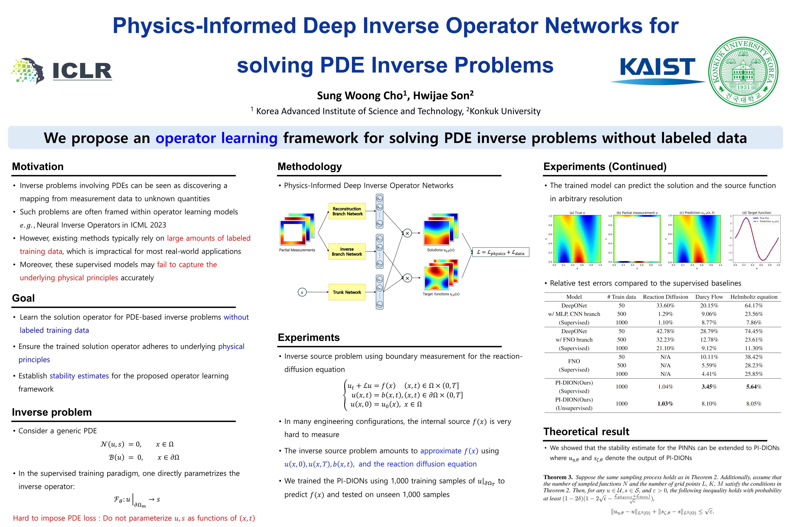

# International Conference on Learning Representations ICLR2025
- **Location:** Singapore EXPO
- **Dates:** April 24-28

## Conference

| Label | Title | Figure | Keyword | Note |
|-------|-------|--------|---------|------|
| **Method** |||||  
| **LLM** |||||  
| xx | Transformer-based Language Models for Scientific Discovery | Fig. 1 | Transformers, GPT, Scientific discovery | Emphasis on knowledge representation |
| xx | Prompt Engineering for Efficient NLP Tasks | Fig. 2 | Prompt Engineering, NLP | Improving task-specific performance |
| **Diffusion Transformer** |||||  
| xx | xx | xx | xx | xx |
| **Physics-Informed Machine Learning** |||||  
| 🔵 Physics-Informed ML | Physics-Informed Deep Inverse Operator Networks for Solving PDE Inverse Problems | N/A    | Inverse Problems, Stability, Operator Learning, Physics-Informed Machine Learning | Proposes PI-DIONs architecture for learning solution operators of PDE-based inverse problems without labeled data.

| **Multimodal** |||||  
| xx | xx | xx | xx | xx |

| **Application** |||||  
| **Material Design** |||||  
| xx | xx | xx | xx | xx |

| **Protein Design** |||||  
| xx | xx | xx | xx | xx |

| **Drug Discovery by BigTech** |||||  
| **Google** |||||  
| xx | xx | xx | xx | xx |

| **Microsoft** |||||  
| xx | xx | xx | xx | xx |

| **ByteDance** |||||  
| xx | xx | xx | xx | xx |

---

*Prepared by [Your Name], [Your Affiliation], [Date]*

## ICLR 2025 Conference Summary

### Categories and Labels

- **🔴 Large Language Models (LLMs)**
- **🟠 Diffusion Models**
- **🟡 Multimodal Learning**
- **🟢 Physics-Informed Machine Learning**
- **🔵 Time Series & Spatiotemporal Modeling**
- **🟣 Optimization & Theory**
- **🟤 Applications in Science & Engineering**
- **⚫ AI Safety & Ethics**
- **⚪ Reinforcement Learning & Planning**

---

### Paper Summary Table

| Label | Title | Figure | Keyword | Note |
|-------|-------|--------|---------|------|
| 🟢 **Inverse Problem** | [Physics-Informed Deep Inverse Operator Networks for Solving PDE Inverse Problems](https://openreview.net/forum?id=0FxnSZJPmh) |  | Inverse Problems, Stability, Operator Learning, Physics-Informed ML | Proposes PI-DIONs architecture for learning solution operators of PDE-based inverse problems without labeled data. |
| 🟢 **Text-Conditioned Simulation** | [Text2PDE: Latent Diffusion Models for Accessible Physics Simulation](https://openreview.net/forum?id=Nb3a8aUGfj) | N/A | Latent Diffusion, PDE Simulation, Neural Operators, Text2PDE | Introduces text-conditioned latent diffusion models enabling accessible and efficient physics simulations from textual descriptions.|
| 🟡🟤 **Procedural Material Generation** | [VLMaterial: Procedural Material Generation with Large Vision-Language Models](https://openreview.net/forum?id=wHebuIb6IH) | N/A | Generative Model, Procedural Material, Appearance Modeling | Leverages large vision-language models to generate procedural materials from input images, enabling intuitive and precise editing for photorealistic material appearance design. Introduces an open-source procedural material dataset and program-level augmentation techniques. |

